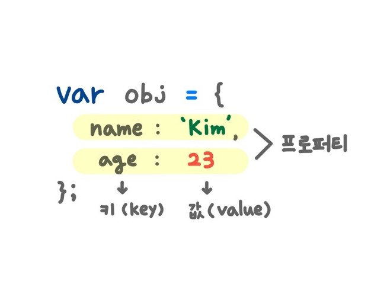
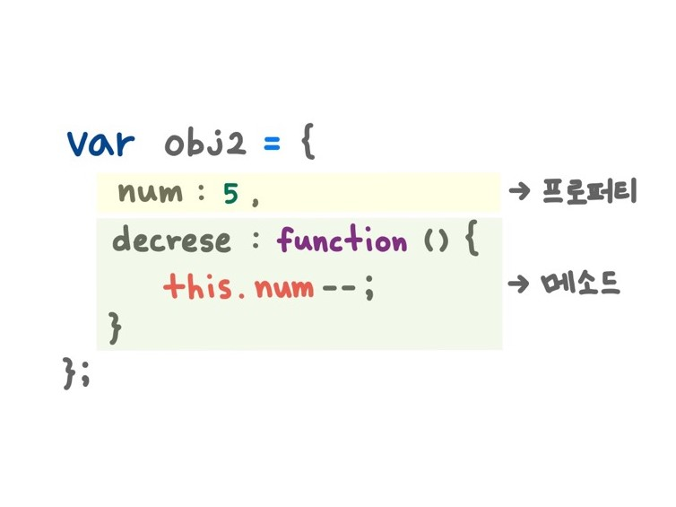

# 객체(object)

- 자바스크립트는 객체 기반 프로그래밍 언어이며, 원시 값을 제외한 나머지 값은 모두 객체이다.
- 객체는 0개 이상의 프로퍼티로 구성된 집합으로, 프로퍼티는 key와 value로 구성된다.
- 프로퍼티 값이 함수일 경우에는 method라 부른다.

<br />

# 프로퍼티와 메서드

- 프로퍼티(property) : 객체의 상태를 나타내는 값
- 메서드(method) : 프로퍼티를 참조하고 조작할 수 있는 동작
<div style="background:#fff">
  
</div>
<div style="background:#fff">
  
</div>

<br />

# 객체 리터럴(object literal)

- 리터럴은 사람이 이해할 수 있는 문자나 약속된 기호를 사용해 값을 생성하는 표기법을 말하는데, 자바스크립트에서 객체를 생성하는 가장 일반적인 방법이 객체 리터럴을 사용하는 것이다.
- 객체 리터럴은 중괄호({}) 내에 0개 이상의 프로퍼티를 정의한다.
- 객체 리터럴의 중괄호는 코드 블록을 의미하는 것이 아니라 값으로 평가되기 때문에 닫는 괄호 뒤에는 세미콜론(;)을 붙인다.

```js
// object literal
var me = {
  name : 'Kim',
  intro : function() {
    console.log(`My name is ${this.name}`);
  }
};

console.log(typeof me);
console.log(me);

[실행결과]
object
{ name: 'Kim', intro: [Function: intro] }
```

<br />

# 프로퍼티(property)

> ✔ 프로퍼티 키(key) : 빈 문자열 포함 모든 string 또는 symbol 값 <br />
> ✔ 프로퍼티 값(value) : 자바스크립트에서 사용할 수 있는 모든 값

- 프로퍼티를 나열할 때는 쉼표(,)로 구분한다.
- 프로퍼티 키는 프로퍼티 값에 접근할 수 있는 이름으로서 식별자 역할을 하는데, 식별자 네이밍 규칙을 준수한다면 따옴표를 생략할 수 있으나 그렇지 않은 경우 반드시 따옴표''를 사용해야 한다. (가급적이면 식별자 네이밍 규칙을 따르는 프로퍼티 키를 사용하는 것이 좋다.)
- 이미 존재하는 프로퍼티 키를 중복 선언하면 나중에 선언한 프로퍼티가 이전의 것을 덮어쓰며 에러도 발생하지 않는다.

```js
var me = {
  name: "Kim",
  age: 23,
};

var me = {
  name: "Kim",
  name: "Yoo",
};

console.log(me);

[실행결과];
Yoo;
```

<br />

# 메서드(method)

- 자바스크립트의 함수는 객체라서 값으로 취급할 수 있기 때문에 프로퍼티 값으로도 사용할 수 있다.

```js
// method
var square = {
  side: 4, // 한 변의 길이

  getArea: function () {
    // 사각형 넓이 구하는 함수
    return this.side * this.side; // this는 객체 자신을 가리키는 참조 변수
  },
};

console.log(square.getArea());

[실행결과];
16;
```
