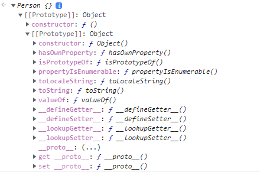
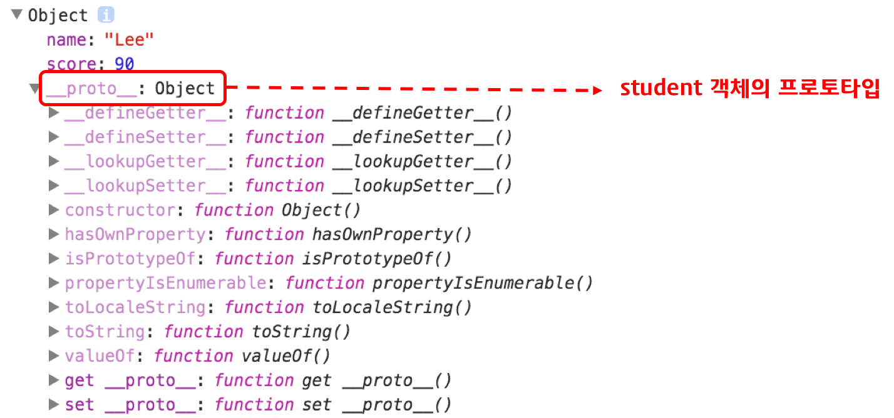

# Prototype

## ✔ 프로토타입 객체

Java, C++과 같은 클래스 기반 객체지향 프로그래밍 언어와 달리 자바스크립트는 프로토타입 기반 객체지향 프로그래밍 언어이다.

클래스 기반 객체지향 프로그래밍 언어는 객체 생성 이전에 클래스를 정의하고 이를 통해 객체(인스턴스)를 생성한다. 하지만 프로토타입 기반 객체지향 프로그래밍 언어는 클래스 없이(Class-less)도 (ECMAScript 6에서 클래스가 추가되었다) 객체를 생성할 수 있다.

<br />

## ✔ 자바스크립트의 객체 생성 방법

자바스크립트의 모든 객체는 자신의 부모 역할을 담당하는 객체와 연결되어 있다.<br />
그리고 이것은 마치 객체 지향의 상속 개념과 같이 부모 객체의 프로퍼티 또는 메소드를 상속받아 사용할 수 있게 한다.<br />
이러한 부모 객체를 Prototype(프로토타입) 객체 또는 줄여서 Prototype(프로토타입)이라 한다.<br />
Prototype 객체는 생성자 함수에 의해 생성된 각각의 객체에 공유 프로퍼티를 제공하기 위해 사용한다.

```js
var student = {
  name: "Lee",
  score: 90,
};

// student에는 hasOwnProperty 메소드가 없지만 아래 구문은 동작한다.
console.log(student.hasOwnProperty("name")); // true

console.dir(student);
```

ECMAScript spec에서는 자바스크립트의 모든 객체는 [[prototype]]이라는 인터널 슬롯(internal slot)를 가진다.

[[prototype]]의 값은 null 또는 객체이며 상속을 구현하는데 사용된다.

[[prototype]] 객체의 데이터 프로퍼티는 get 액세스를 위해 상속되어 자식 객체의 프로퍼티처럼 사용할 수 있다. 하지만 set 액세스는 허용되지 않는다. 라고 되어있다.

```js
var Person = function(){}
new Person();

// 출력결과
Person {}[[Prototype]] ...
```

<div style="background:#fff">
  
</div>

<br />

[[prototype]]의 값은 Prototype(프로토타입) 객체이며 **proto** accessor property로 접근할 수 있다. **proto** 프로퍼티에 접근하면 내부적으로 Object.getPrototypeOf가 호출되어 프로토타입 객체를 반환한다.
student 객체는 **proto** 프로퍼티로 자신의 부모 객체(프로토타입 객체)인 Object.prototype을 가리키고 있다.

```js
var student = {
  name: "Lee",
  score: 90,
};
console.log(student.__proto__ === Object.prototype); // true
```

<div style="background:#fff">
  
</div>

<br />

객체를 생성할 때 프로토타입은 결정된다. <br />
결정된 프로토타입 객체는 다른 임의의 객체로 변경할 수 있다.<br />
이것은 부모 객체인 프로토타입을 동적으로 변경할 수 있다는 것을 의미한다.<br />
이러한 특징을 활용하여 객체의 상속을 구현할 수 있다.<br />

##
