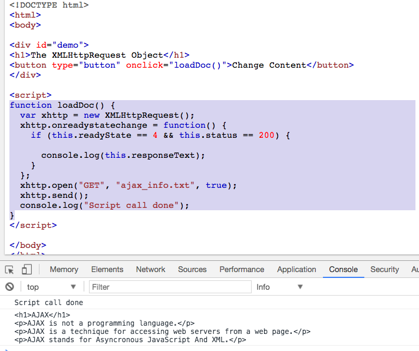

# Callstack

자바스크립트는 하나의 스레드로 단 1개의 동시성만 다루는 언어입니다. 이것이 의미하는 것은 자바스크립트가 한 번에 1개의 작업만 다룰 수 있다는 얘기죠. 자바스크립트는 힙, 큐와 함께 구성하는 단일 콜스택을 갖습니다. 이것은 V8 내부에 구현되어 있습니다

<br />

## 콜 스택

함수의 호출을 기록하는 자료구조입니다. 기본적으로 우리가 프로그램 안에서 위치한 곳이죠. 만약 우리가 어떤 함수를 실행시킨다면, 우리는 스택 위에 무언가를 올리는(push) 행위를 하는 겁니다. 그리고 우리가 함수로 부터 반환을 받을 때, 우리는 스택의 맨 위를 가져오는(pop) 것이죠.

<div>
  
<div>

> 이 모든 것들은 짧은 시간(jiffy time, ms[마이크로 세컨드]) 안에 처리됩니다.

1. 모든 실행이 시작되는 메인 함수를 찾는 일
2. console.log(bar(6));가 먼저 콜스택에 추가.
3. 그다음 bar 함수가 매개변수들과 같이 스택의 상단에 추가
4. foo 함수 스택에 상단에 추가 후 곧장 값을 반환(pop)
5. bar 함수와 console.log(bar(6)); 구문이 차례로 반환(pop)
6. console.log(bar(6)); 값 출력

<br />

> 브라우저 콘솔에서 가끔 긴 빨간색 에러 스택들을 본 기억이 있을 것입니다. 보통 그것들은 콜스택의 현재 상태를 나타냅니다. 그리고 실패한 함수를 스택처럼 top부터 bottom까지 나타내는 거죠.

<div>
  
<div>

<br />

> 가끔 우리는 함수를 재귀적으로 여러번 부르다가 무한 루프에 빠지게 됩니다. 크롬 브라우저는 16000 프레임의 제한된 스택을 가지고 있어서 이 범위를 넘어서게 된다면 Max Stack Error Reached 라는 상태가 되고 실행 중이던 것을 죽입니다.

<div>
  
<div>

## 힙

오브젝트(객체)들은 힙 내부에 할당됩니다. 힙은 거의 구조화되지 않은 영역(unstructured)의 메모리입니다. 변수와 객체들의 모든 메모리 할당이 여기서 일어나게 됩니다.

## 큐

자바스크립트 런타임은 메시지 큐를 갖고 있습니다. 메시지 큐는 실행될 콜백함수나 실행될 메시지들에 대한 리스트입니다. 스택이 충분한 공간(capacity)을 갖고 있을 때, 메시지는 큐 밖으로 나오게 되고 메시지가 가지고 있던 함수 목록들이 실행됩니다. 이렇게 초기 스택 프레임이 만들어집니다. 스택이 다시 빌 때 메시지 수행도 끝나게 됩니다. 이벤트들에 대한 콜백 함수가 제공되었다고 가정했을 때 이 메시지들은 외부 비동기 이벤트들에 대한 응답으로 큐에 쌓입니다. 여기서 외부 비동기 이벤트들이란 마우스 클릭, HTTP 요청 등을 말합니다. 하지만 만일 한 사용자가 버튼을 눌렀는데 아무런 콜백함수도 등록되어 있지 않다면 어떠한 메시지도 큐에 들어가지 않을 것입니다.

## 이벤트 루프

일반적으로 우리가 자바스크립트 코드의 성능을 측정할 때, 스택 안에 있는 함수는 성능을 느리게도 빠르게도 만듭니다. 만일 console.log()한 줄만 있다면 우리의 코드는 빠릅니다. 하지만 수천 수백만개가 넘는 for문 또는 while문과 같은 반복문 수행한다면 우리의 코드는 매우 느릴 것입니다. 또 그 코드들은 스택을 계속 차지하고 있을 것입니다. 이런 것들을 가리켜 우리는 'Blocking Script'라 부릅니다. 이 용어는 'Webpage Speed Insights' 라는 홈페이지에 방문한다면 쉽게 볼 수 있는 용어입니다.

네트워크 요청은 느릴 수 있습니다. 이미지 요청도 느릴 수 있습니다. 하지만 감사하게도 서버 요청들은 비동기 함수인 AJAX를 통해 할 수 있습니다. 만일 이러한 네트워크 요청들이 동기화 함수들을 통해서 이뤄졌다고 한다면, 무슨 일이 벌어질까요? 먼저 컴퓨터가 네트워크 요청을 받는다면 그 요청은 또 다른 컴퓨터나 기계와 같은 어떤 서버로 갈 것입니다. 네트워크 응답은 응답자의 사정에 따라 아주 많이 느려질 수 있습니다. 그 동안, 우리가 만약 CTA(Call To Action) 버튼이나 렌더링이 필요한 무언가를 클릭한다면 스택이 막혀있기 때문에 어떠한 반응도 일어나지 않을 것입니다. 루비와 같은 멀티 스레드 언어에서는 이러한 일도 잘 해결될 수 있습니다. 하지만 싱글 스레드 언어인 자바스크립트는 스택에 쌓인 함수들에서 어떠한 값을 반환하기 전까지는 불가능합니다. 그 웹페이지는 브라우저가 아무 것도 할 수 없기 때문에 완전히 망가질 것입니다. 우리가 엔드 유저를 위해 유동적인 UI를 원한다면 이러한 방법은 그리 이상적이지 않습니다. 우리는 어떻게 싱글 스레드로 이상적인 환경을 만들 수 있을까요?

<br />

> 자바스크립트에서의 동시성 - 한번에 한 일만 한다. 단, 비동기 콜백들을 제외하고

<br />

가장 쉬운 해결책은 비동기 함수들을 이용하는 것입니다. 비동기 콜백을 이용한다는 것은 우리가 코드의 일정 부분을 실행시키고 나중에 실행될 콜백함수를 스택에 넣는 것을 말합니다. 우리는 개발을 하다보면 반드시 AJAX와 같은 비동기형 콜백($.get(), setTimeout(), setInterval(), Promises, etc...)을 마주하게 됩니다. 사실 노드는 비동기 함수 실행이 전부입니다. 모든 비동기 콜백들console.log(), mathematical operations은 코드에서 읽히자마자 바로 실행되지 않고 잠시 후에 실행됩니다. 그래서 동기 함수들과는 다르게 바로 스택의 내부로 push될 수 없습니다. 그렇다면 비동기 콜백은 대체 어디로 가고 어떻게 다뤄지는 걸까요?

<div>
  
<div>

위의 코드에서 자바스크립트의 네트워크 액션 요청(request in action)을 봅시다.

요청 함수가 실행됩니다. 요청이 들어온 때에 실행될 콜백으로 onreadystatechange 이벤트 안에 있는 익명의 함수를 넘깁니다.
"Script call done!"은 동기 함수로 코딩되어 있기 때문에 바로 콘솔의 output에 들어갑니다.
비동기 함수가 실행될 때가 됐을 때, 서버로부터의 응답이 오고 body부분을 콘솔에 출력하며 콜백이 실행됩니다.
응답(response)에서의 호출자(caller)의 분리는 자바스크립트 런타임이 당신의 비동기 명령이 완료되고 콜백이 호출될 때까지 기다리는 동안 다른 일을 하는 것을 허용합니다. 2여기에서는 브라우저 API들이 작동합니다. DOM 이벤트들, http요청들, setTimeout과 같은 비동기 이벤트들을 다루기 위해 브라우저 내부 C++로 구현된 코드들에 의해 만들어진 기본적인 스레드들(threads)의 API를 호출합니다. (이 것들을 이해했다면 앵귤러2에서, 런타임 변화 감지를 일으키기 위한 이런 API들을 몽키패치(강제로 오버라이딩하여 프로그램의 행동을 바꾸는 것)하기 위해 Zones가 사용됐다는 것을 알게 됩니다.)

지금 이 웹 API들은 스스로 자신들의 실행코드를 스택에 넣을 수 없습니다. 만일 이런 일이 일어났다면, 당신의 코드 중간에 랜덤하게 나타나게 될 것입니다. 위에서 다뤄진 메세지 콜백 큐가 이것을 증명합니다. 3현재 실행 중인 코드가 끝난다면 웹 API중 어느 하나가 콜백을 큐에 넣습니다. 이벤트 루프는 큐 안의 콜백들을 스택이 비었을 때 밀어넣는 일을 담당합니다. 이벤트 루프가 하는 기본적인 일 중에 하나는 스택과 작업 큐를 보고 스택이 비었을 때 큐에 첫번째에 있는 콜백을 스택에 밀어넣는 일을 합니다. 다른 메시지가 들어오기 전에 각각의 메시지 또는 콜백들은 작업을 완료합니다.

<br />

```js
while (queue.waitForMessage()) {
  queue.processNextMessage();
}
```

> 계속하여 메시지를 기다리다가 다음 메시지를 진행시키는 역할을 합니다.

<br />

<div>
  
<div>

메시지들은 웹 브라우저에서 언제든 이벤트가 발생했을 때 추가됩니다. 그리고 이벤트들에는 이벤트 리스너가 붙어있죠. 만일 리스너가 없다면 발생한 이벤트는 그냥 사라집니다. 언제든 우리가 웹 브라우저에서 어떤 요소를 클릭했을 때, 클릭 이벤트 핸들러는 큐에 메시지를 추가합니다. 웹브라우저의 다른 이벤트들도 동일합니다. 이러한 콜백 함수 호출은 콜스택 안에서 초기의 프레임의 역할을 합니다. 그리고 자바스크립트는 싱글스레드이기 때문에, 추가적인 폴링 중 메시지와 프로세싱은 잠시 중단되고 스택에 있는 모든 호출들의 return을 기다립니다. 그리고 동기 함수들은 스택에 새로운 콜 프레임들을 추가합니다.
