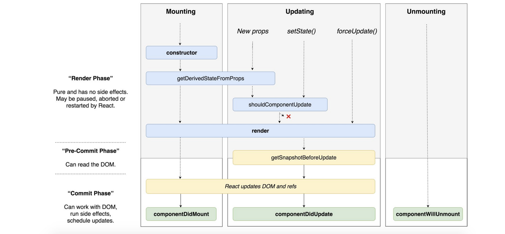

# Rendering

## React Re Rendering 조건

<div style="background:#fff">
  
</div>

### state 변경이 있을 때

- react 에서 유동적인 데이터를 저장하기 위해서 state 라는 것을 이용한다. 이때 state 값을 바꿔주기 위해서는 state 를 직접 조작해서는 안되고 setState() 메서드를 이용해 주어야한다. 왜냐하면 리액트는 state 의 변경이 감지되면 리렌더링을 해주는 데 메서드를 사용하지 않고 직접 바꿔주게 되면 리액트가 state 의 변경을 감지하지 못하게 된다.

### 새로운 props이 들어올 때

- 전달받은 props 값이 업데이트 됬다면 리 렌더링 된다.

### 부모 컴포넌트가 렌더링 될 때

- 새로운 prop 이 들어오지 않더라고 부모컴포넌트가 리렌더링 된다면 자식컴포넌트 역시 리렌더링이 된다.

### shouldComponentUpdate에서 true가 반환될 때

- 각각의 컴포넌트는 shouldComponentUpdate 라는 메소드를 가지고 있는데 이는 state가 병경되거나 새로운 props를 전달받는경우 실행이 된다 이때 기본적으로 return 값은 true 가 되어 rendering 이 시작되지만 rerendering 이 필요하지 않은 부분이라면 개발자가 return value 를 false 값으로 지정함으로써 리렌더링 되는 상황을 막아줄수 있게된다.

### forceUpdate가 실행될 때

- props 나 state 가 아닌 다른 값이 변경되었을 때 리렌더링을 하고 싶다면 그때 사용할수 있는 메서드 이다.

```js
import React from "react";

class App extends React.Component {
  reRender = () => {
    // calling the forceUpdate() method
    this.forceUpdate();
  };
  render() {
    console.log("Component is re-rendered");
    return (
      <div>
        <h2>GeeksForGeeks</h2>
        <button onClick={this.reRender}>Click To Re-Render</button>
      </div>
    );
  }
}
export default App;
```

<br />

## Rendering 최적화

### react.memo

- 리액트는 컴포넌트를 렌더링 한뒤 이전의 렌더링된 결과와 비교후 변경된 사항을 확인한뒤 dom 을 업데이트 해준다.

- 개발자는 이전의 컴포넌트와 비교가 필요하지 않은 경우를 알고 있기 때문에 그러한 경우에는 컴포넌트를 react.memo() 로 래핑 해줄수 있다. 그렇게 하면 리액트는 컴포넌트를 렌더링 한뒤 그 결과를 기억(memoizing) 하기 때문에 새롭게 렌더링 하고 이전과 비교하는 과정을 생략할 수있게된다. (재사용)
- 이러한 memoizing 은 props 가 같을 대에만 적용이 되기 때문에 props 가 바뀌면 기존의 작업을 수행한다.

```js
export function Movie({ title, releaseDate }) {
  return (
    <div>
      <div>Movie title: {title}</div>
      <div>Release date: {releaseDate}</div>
    </div>
  );
}

export const MemoizedMovie = React.memo(Movie);
```

### useMemo

- usememo 는 계산량이 많은 함수의 반환값을 기억할수 있다.

```js
import React, { useMemo } from "react";
import { runExpensiveJob } from "./util";

function MyComponent({ v1, v2 }) {
  const value = useMemo(() => runExpensiveJob(v1, v2), [v1, v2]);
  return <p>{`value is ${value}`}</p>;
}
```

- 사용법은 useEffect 와 비슷하다. 첫번째 인자로 기존의 함수가 들어간다. 첫번째 인자로 들어오는 함수값은 memoizing 된다.

- 메모이징(기억) 된 값은 해당 컴포넌트가 리렌더링 될때 재선언 이후 실행 되지 않고 기억된 값을 사용한다.

- 두번째 인자는 의존성 배열이 들어온다. 의존성 배열에 해당하는 값이 바뀌게 되면 첫번재 인자로 들어오는 함수는 재선언뒤 다시 값을 반환 하고 그값을 기억한다.

### useCallback

- useMemo 는 특정 결과값을 재사용 할 때 사용하는 반면, useCallback 은 특정 함수를 새로 만들지 않고 재사용하고 싶을때 사용합니다.

- 컴포넌트 내부의 함수들은 리렌더링 시 마다 새로 선언 된다 이자체는 많은 리소스를 차지하는 것은 아니지만 이 함수들을 기억해서 재사용 하는 것은 중요하다.

- 왜냐하면 우리는 함수를 props 로 넘겨주는 일을 하는 경우가 많은데 이때 우리는 나중에 props 가 변경되지 않으면 virtual dom 에서 새롭게 렌더링 하지 않도록 최적화 작업을 해줄수가 있게 된다 그런데 매번 함수가 변경되고 그함수를 props 로 넘겨주게 되면 매번 리렌더링 이 되기 때문에 최적화 작업에서 props 로 넘겨주는 함수는 useCallback 을 이용해 함수를 재사용 해주는 것이 필수이다.

```js
function Profile() {
  const [name, setName] = useState("");
  const [age, setAge] = useState(0);
  const onSave = useCallback(() => saveToServer(name, age), [name, age]);
  return (
    <div>
      <p>{`name is ${name}`}</p>
      <p>{`age is ${age}`}</p>
      <UserEdit onSave={onSave} setName={setName} setAge={setAge} />
    </div>
  );
}
```

### 언제 React.memo()를 써야할까

- 컴퍼넌트가 같은 props로 자주 렌더링되거나, 무겁고 비용이 큰 연산이 있는 경우, React.memo()로 컴퍼넌트를 래핑할 필요가 있다.

### 언제 React.memo()를 사용하지 말아야 할까

- 위에서 언급한 상황에 일치하지 않는다면 React.memo()를 사용할 필요가 없을 가능성이 높다.

- 렌더링될 때 props가 다른 경우가 대부분인 컴포넌트를 생각해보면, 메모이제이션 기법의 이점을 얻기 힘들다.
- 또한, 기술적으로는 가능하지만 클래스 기반의 컴퍼넌트를 React.memo()로 래핑하는것은 적절하지 않다.
- 클래스 기반의 컴퍼넌트에서 메모이제이션이 필요하다면 PureComponent를 확장하여 사용하거나, shouldComponentUpdate() 메서드를 구현하는 것이 적절하다.
